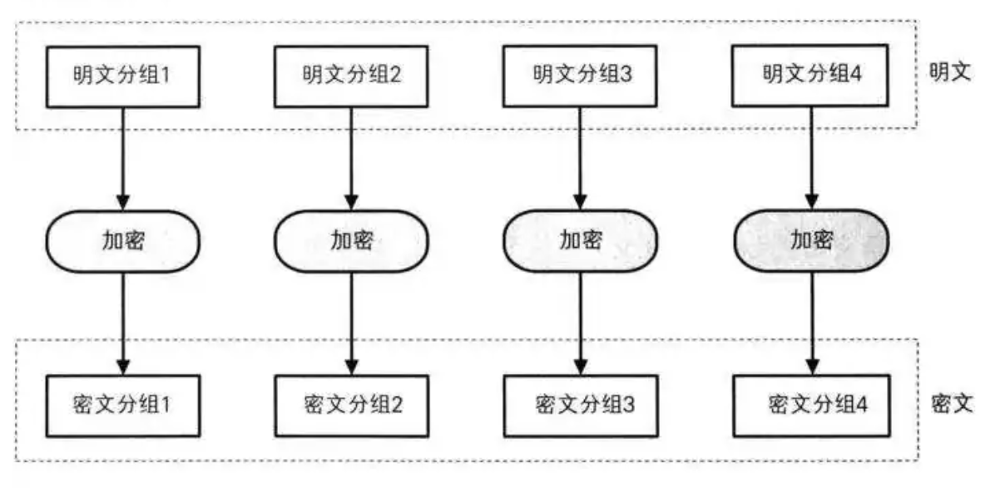
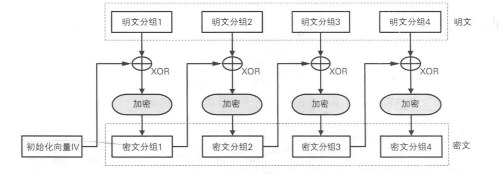
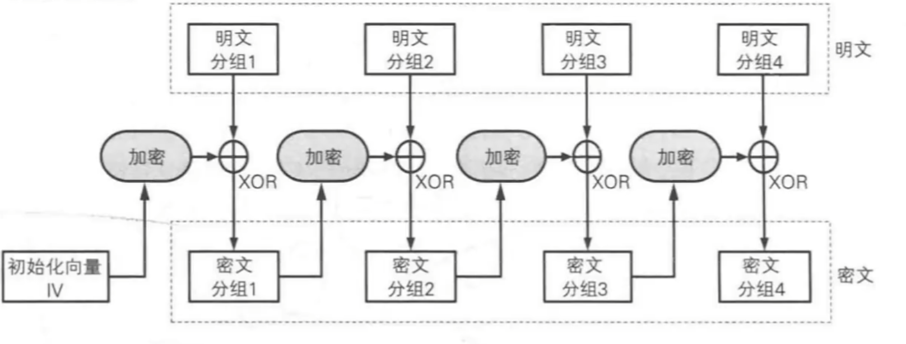
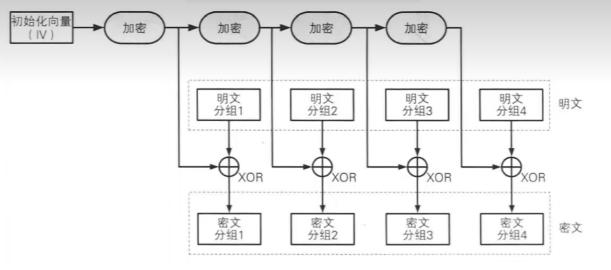
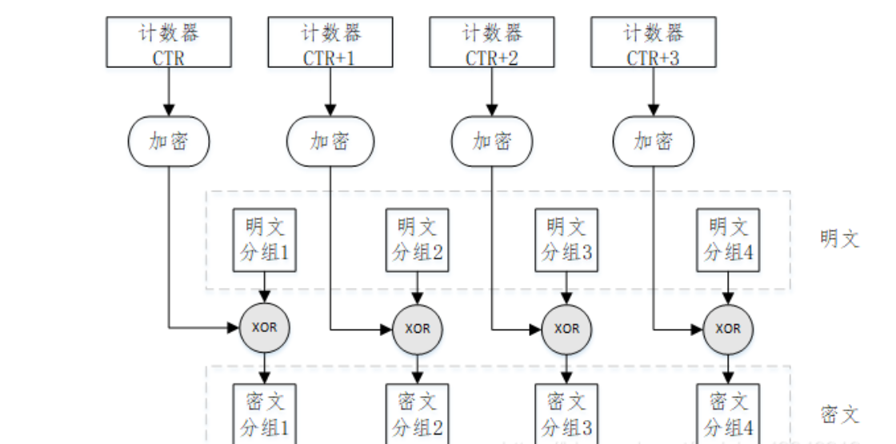

密码是密码算法、密钥管理和密码协议的总合。

- 密码算法是指实现明密变换的数学模型、逻辑结构、变化函数，是密码中相对固定的部分

- 密钥是参与、控制密码算法实现明密变换的可变参数，是密码中最活跃的部分

- 密码协议是指为完成特定任务而应用密码所必需遵循的操作步骤，是密码中最稳定的部分。最基本的密码协议是密钥交换协议和身份鉴别协议

## 古典密码的主要编制方法

- 置换密码 (移项式密码)：改变明文里字符顺序形成密文

- 替换密码 (替换式密码)：对明文字符进行替换，如凯撒密码，维吉尼亚密码

## 分组密码

分组密码首先对明文消息根据分组大小进行分组，再将明文分组、密钥和初始向量（如果有）一起作为输入，通过分组加密算法直接输出密文分组。

### 分组密码算法

#### DES ( Data Encryption Standard ) - 数据加密标准

- 对称加密算法

- 诞生于1970年

- 分组长度 64 位 

- 密钥长度 56 位 + 8 位奇偶校验位

- 现已被证实不安全，不推荐使用

#### 3DES ( Triple DES ) - 三重数据加密算法

- 对称加密算法

- 诞生于 1990 年

- 分组长度 64 位

- 密钥长度 112 位或 168 位

- 通过增加密钥长度来解决 DES 的安全问题，但也正在被淘汰

#### AES ( Advanced Encryption Standard ) - 高级加密标准

- 对称加密算法

- 诞生于 2000 年

- 分组长度 128 位

- 密钥长度 128 / 192 / 256 位

- 当前最广泛使用的对称加密算法

#### SM4 ( 国密算法4 )

- 对称加密算法

- 诞生于 2006 年，由中国国家密码管理局发布

- 分组长度 128 位

- 密钥长度 128 位

- 中国的国家商用密码标准，在中国境内强制或推荐使用

### 分组密码的工作模式

分组密码共有七种工作模式：电码本模式（ECB）、密文分组链接模式（CBC）、输出反馈模式（OFB）、计数器模式（CTR）、分组链接模式（BC）、带非线性函数的输出反馈模式（CTR）

#### ECB ( Electronic Codebook ) - 电子密码本

 

 - 特点：无初始向量，并行加密和解密

 - 安全性：相同的明文分组会产生相同的密文分组，这会暴露数据的模式和结构

#### CBC ( Cipher Block Chaining ) - 密码分组链接

 

 - 特点：需要随机且不可预测的初始向量，加密串行、解密并行。一个密文分组在传输中损坏，会影响对应明文分组和下一个明文分组的解密

 - 安全性：高于 ECB，且由于解密需要顺序，解决了 ECB 可以被攻击者任意修改密文顺序的问题

#### CFB ( Cipher Feedback ) - 密码反馈

 

 - 特点：需要初始向量，加密和解密过程都使用加密函数，不使用解密函数，在硬件实现时有优势
 
 - 安全性：能被重放攻击

 - 注意：此时加密函数加密的是初始向量 / 密文，而非明文，意味着明文是通过与加密函数输出的密钥流进行异或的，并不直接作用在明文上，加密过程从块密码变成了流密码，加密函数的输入不再要求与块大小一致。

#### OFB ( Output Feedback ) - 输出反馈

 

 - OFB加密模式的"改进版"，大体类似

#### CTR ( Counter ) - 计数器模式

 

 - CTR 模式同样将块密码变成了流密码，