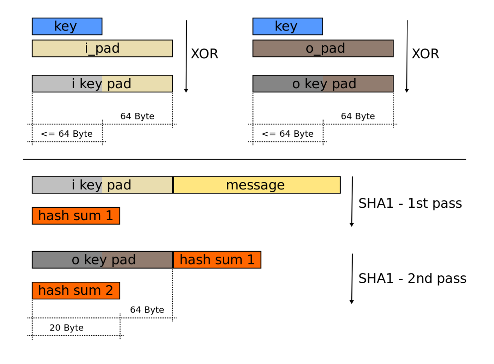

密码是密码算法、密钥管理和密码协议的总合。

- 密码算法是指实现明密变换的数学模型、逻辑结构、变化函数，是密码中相对固定的部分

- 密钥是参与、控制密码算法实现明密变换的可变参数，是密码中最活跃的部分

- 密码协议是指为完成特定任务而应用密码所必需遵循的操作步骤，是密码中最稳定的部分。最基本的密码协议是密钥交换协议和身份鉴别协议

## 古典密码的主要编制方法

- 置换密码 (移项式密码)：改变明文里字符顺序形成密文

- 替换密码 (替换式密码)：对明文字符进行替换，如凯撒密码，维吉尼亚密码

## 分组密码

分组密码首先对明文消息根据分组大小进行分组，再将明文分组、密钥和初始向量（如果有）一起作为输入，通过分组加密算法直接输出密文分组。

### 分组密码算法

#### DES ( Data Encryption Standard ) - 数据加密标准

- 对称加密算法

- 诞生于1970年

- 分组长度 64 位 

- 密钥长度 56 位 + 8 位奇偶校验位

- 现已被证实不安全，不推荐使用

#### 3DES ( Triple DES ) - 三重数据加密算法

- 对称加密算法

- 诞生于 1990 年

- 分组长度 64 位

- 密钥长度 112 位或 168 位

- 通过增加密钥长度来解决 DES 的安全问题，但也正在被淘汰

#### AES ( Advanced Encryption Standard ) - 高级加密标准

- 对称加密算法

- 诞生于 2000 年

- 分组长度 128 位

- 密钥长度 128 / 192 / 256 位

- 当前最广泛使用的对称加密算法

#### SM4 ( 国密算法4 )

- 对称加密算法

- 诞生于 2006 年，由中国国家密码管理局发布

- 分组长度 128 位

- 密钥长度 128 位

- 中国的国家商用密码标准，在中国境内强制或推荐使用

### 分组密码的工作模式

分组密码共有七种工作模式：电码本模式（ECB）、密文分组链接模式（CBC）、输出反馈模式（OFB）、计数器模式（CTR）、分组链接模式（BC）、带非线性函数的输出反馈模式（CTR）

#### ECB ( Electronic Codebook ) - 电子密码本

 

 - 特点：无初始向量，并行加密和解密

 - 安全性：相同的明文分组会产生相同的密文分组，这会暴露数据的模式和结构

#### CBC ( Cipher Block Chaining ) - 密码分组链接

 

 - 特点：需要随机且不可预测的初始向量，加密串行、解密并行。一个密文分组在传输中损坏，会影响对应明文分组和下一个明文分组的解密

 - 安全性：高于 ECB，且由于解密需要顺序，解决了 ECB 可以被攻击者任意修改密文顺序的问题

#### CFB ( Cipher Feedback ) - 密码反馈

 

 - 特点：需要初始向量，加密和解密过程都使用加密函数，不使用解密函数，在硬件实现时有优势
 
 - 安全性：能被重放攻击

 - 注意：此时加密函数加密的是初始向量 / 密文，而非明文，意味着明文是通过与加密函数输出的密钥流进行异或的，并不直接作用在明文上，加密过程从块密码变成了流密码，加密函数的输入不再要求与块大小一致。

#### OFB ( Output Feedback ) - 输出反馈

 

 - OFB加密模式的"改进版"，大体类似

#### CTR ( Counter ) - 计数器模式

 

 CTR 模式同样将块密码变成了流密码

 工作模式：首先需要一个 Nonce 和一个计数器。

 - Nonce：一个随机数，只需要在给定密钥下唯一即可，不需要像 CBC 的初始向量那样必须是随机的。它与初始向量作用类似，Nonce 的长度通常小于块大小

 - 计数器：一个从初始值（通常为 0 或 1）开始，按固定步长（通常为 1）递增的变量

 - 将 Nonce 和计数器拼接起来，就构成了一个完整的、不会重复的输入块，我们称之为**计数器块**

 密钥流生成过程：对计数器块进行加密，从图里可以看出这非常像 ECB 加密模式的升级版。
  
  - 特点：可以并行加密并行解密，并且可以优先解密任意一个块

### 分组密码的应用

1. 数据保密性 - 保护数据不被窃听

2. 认证加密 - 同时确保保密性与完整性

3. 消息认证 - 确保消息未被篡改

4. 伪随机数生成

5. 密钥派生

---

- HTTPS：浏览器与电商网站服务器建立 TLS 连接，双方协商使用 AES-256-GCM，所有提交的个人信息、信用卡号，以及网站返回的页面，都通过 AES-GCM 进行加密和认证

- 智能手机安全：手机存储芯片通常使用 AES-XTS 进行全盘加密，解锁手机后，系统会解密数据

- 无线网络：路由器可能使用 WPA2（使用 AES-CCMP，CCMP 基于 AES-CCM）或 WPA3（使用 AES-GCM）来加密空中传输的数据

- 数字支付：信用卡的芯片（EMV）交易使用分组密码（通常是 3DES 或 AES）来认证和保护交易数据

- 软件与系统更新：当下载操作系统更新时，软件包通常附有一个由 CMAC 或类似技术生成的数字签名，以确保下载的是官方正版，未被植入恶意代码

## 序列密码

序列密码是将密钥和初始向量（IV）作为输入，通过密钥流生成算法输出密钥流，然后将明文序列和密钥流进行异或，得到密文序列

### 序列密码算法

#### RC4

 RC4 是由 Ron Rivest 在 1987 年为 RSA Security 公司设计的，它曾是最著名、最广泛使用的流密码之一

 实现过程：现有初始化数组 `S` 和密钥 `K` ，利用密钥调度算法（KSA）来打乱数组 `S` ，此过程有密钥参与。再根据伪随机生成算法（PRGA）生成密钥流，对明文进行加密

 - 优点：极其简单，速度飞快：算法主要由交换和模加组成，在软件中实现效率非常高，曾用于 SSL/TLS、WEP、WPA、Microsoft Office、PDF 等众多协议和软件中

 - 缺点：现已被完全破解和证实不安全

 #### ZUC（祖冲之算法）

 ZUC是由中国密码学家自主设计的流密码，是为中国 3G 移动通信的 LTE（4G）国际标准量身定制的

- 密钥长度：128 位

- 初始向量长度：128 位

### 序列密码应用
 1. 无线通信与移动网络
 2. 网络协议安全
 3. 资源受限的嵌入式系统与物联网
 3. 存储介质加密

## 杂凑算法

杂凑算法是一种将任意长度的输入数据映射为固定长度的输出数据的单向密码学函数，又叫**散列算法**、**哈希算法**

杂凑算法有以下特点：

- 确定性：相同的输入消息在任何时间、任何环境下都会产生完全相同的杂凑值

- 高效性：计算任意长度消息的杂凑值都非常迅速

- 单向性：从杂凑值不能（在计算上不可能）反推出原始输入消息

- 抗弱碰撞性：给定一个输入消息 m1，无法找到另一个不同的消息 m2，使得 m1 和 m2 的杂凑值相同

- 抗强碰撞性：无法找到任意两个不同的消息 m1 和 m2，使得它们的杂凑值相同，这是比抗弱碰撞性更强的要求，因为攻击者可以自由选择两个消息

- 雪崩效应：输入消息中哪怕只有1个比特发生改变，产生的杂凑值也会发生无法预测的改变，新的杂凑值看起来与旧的杂凑值完全无关

### 杂凑算法攻击方式

 1. 彩虹表攻击：一种预先计算好的`明文-杂凑值`对照表，用于反向查找由杂凑值对应的明文。可以通过`加盐`来防御，即在密码计算杂凑前拼接一个随机字符串（盐），使得预计算的彩虹表失效
 
 2. 生日攻击:大量生成文件计算杂凑值进行碰撞

### 杂凑算法种类

 - 国际算法：MD5、SHA-1、SHA-2、SHA-3

 - 国密算法：SM3

 **MD5 算法和 SHA-1 算法已被证实不安全**

#### SHA算法系列

1. SHA-1
    - 发布时间：1995年
    - 输出长度：160 位
    - 安全性：已破解

2. SHA-2
    - 发布时间：2001年
    - 输出长度：根据变体 SHA-256 / SHA-512 输出不同长度
    - 安全性：安全，为当前的国际标准

3. SHA-3
    - 发布时间：2015年
    - 输出长度：根据变体变体 SHA3-224 / SHA3-256 / SHA3-384 / SHA3-512 输出不同长度
    - 安全性：安全，由于 SHA-2 依旧安全，推广较慢

#### SM3算法系列

SM3 是中国国家密码管理局于 2010 年发布的商用密码杂凑算法标准

- 输出长度：256 位

- 安全性：安全，与 `SHA-256` 安全性相当

### 杂凑算法应用领域

- TLS/SSL 证书（网站 HTTPS）

- 比特币和区块链（SHA-256 是比特币工作量证明的核心）

- 软件分发校验（如 Linux 发行版 ISO 文件）

- 数字签名（与 RSA/ECC 结合使用）

- 密码派生函数（如 PBKDF2 with HMAC-SHA256）

## 消息认证码

消息验证码，简称MAC（Message Authentication Code），MAC与消息拼接在一起构成完整报文，消息中的任何变化，在重新计算时都引起MAC变化。重新计算的MAC与报文中的MAC比较可以察觉消息的改变

具体工作原理为：

 1. 发送方和接收方共享一个秘密密钥 K。

 2. 发送方对消息 M 和密钥 K 应用 MAC 算法，生成认证标签 T：T = MAC(K, M)

 3. 发送方将 (M, T) 一起发送给接收方。

 4. 接收方收到 (M', T') 后，使用相同的密钥 K 和消息 M' 重新计算 MAC 值：T_verified = MAC(K, M')

 5. 接收方比较 T' 和 T_verified：

    - 如果相等，则证明消息未被篡改且来自合法的发送方

    - 如果不相等，则丢弃消息

### HMAC ( 基于哈希的消息认证码 )

直接使用杂凑函数来构造 MAC 是不安全的，容易受到长度扩展攻击等, HMAC 是一种利用密码学杂凑函数（ 如 SHA-256, SM3）来构造 MAC 的安全、标准化的方法,它克服了原生哈希构造的弱点

以 SHA-1 为例，实现步骤如下：

1. 对密钥 `Key` 预处理，若长度高于杂凑函数的分组长度 `B`，则先对 `Key` 进行杂凑，使其缩短，否则填充零字节以符合长度要求

2. 分别与 `i_pad` 和 `o_pad` 异或运算，得到 `i_key_pad` 和 `o_key_pad`
    - i_pad ( 内部填充 ) 为字节 `0x36` 重复 `B` 次
    - o_pad ( 外部填充 ) 为字节 `0x5C` 重复 `B` 次。

3. `i_key_pad` 与 `message` 拼接计算 `hash_sum_1`

4. `o_key_pad` 与 `hash_sum_1` 拼接计算 `hash_sum_2`

5. `hash_sum_2` 即是最终 HMAC 值

基于不同算法的 HMAC 只需要更换步骤中的 Hash 算法即可

## 公钥密码

### RSA算法

### SM2算法

### RSA算法和SM2算法的特点与应用

## 数字签名的概念和应用
