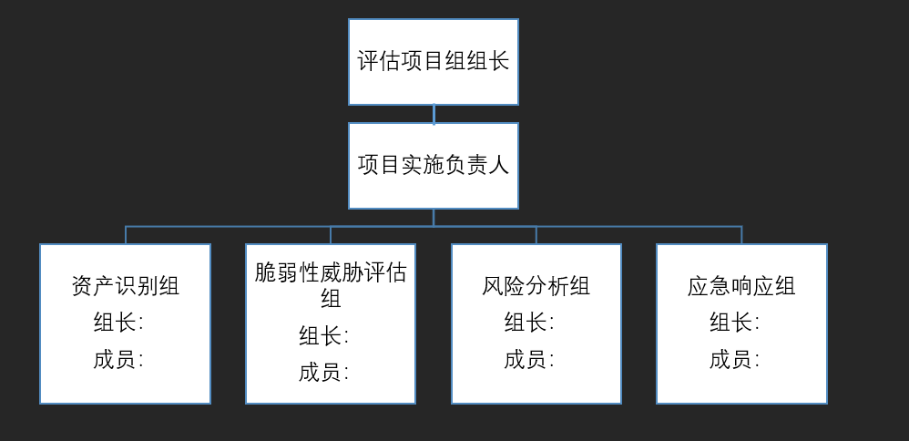

## 基本原则和基本流程

在安全风险评估过程中

首先要确定保护的对象（或者资产）是什么？它的直接和间接价值如何？

其次，资产面临哪些潜在威胁？导致的问题所在？威胁发生的可能性有多大？是否存在已潜伏的威胁？

第三，资产中存在哪些脆弱点可能会被威胁利用？利用的难易程度又如何？

第四，一旦事件发生，组织会遭受怎样的损失或者面临怎样的负面影响？

第五，目前现有的控制措施是否能够防护资产面临的风险？最后，组织应该采取怎样的安全措施才能将风险带来的损失降低到最低程度？

解决以上问题的过程，就是安全风险评估的过程。

流程图如下

总体

1. 准备阶段

    - 确定评估范围

        - 现场访谈客户确定评估范围，主要对象是确定评估系统数量及相关服务器、安全设备、网络设备等硬件设备数量
    
    - 建立评估组织架构

        - 

        - 根据上图的架构，配备相应的人员

            评估项目组组长：负责授权评估项目负责人建立安全风险评估团队、审批项目方案计划和审批项目报告

            项目实施负责人：负责组建项目团队各小组，并指定组长和成员、负责方案计划的编制、负责协调项目所涉及到的各部门人员、负责项目的进度及质量，负责组织审核确认各过程文档，负责安全风险评估报告的编制和负责向领导小组汇报项目实施情况

            资产识别组：负责信息资产的识别工作，并向项目负责人提交阶段成果文档

            脆弱性威胁评估组：负责对资产进行脆弱性威胁评估工作以及防护能力测试评估工作，并向项目负责人提交阶段成果文档

            风险分析组：对资产进行安全措施有效性确认的基础上进行风险分析，形成最终的安全风险评估报告，并向项目负责人提交阶段成果文档

            应急响应组：负责在出现意外情况时进行应急响应

    - 编制方案及计划

        - 根据已确定的评估范围、评估组织以及初步调研的业务现状，确定服务方式及工具并制定工作方案计划，交由项目组组长审批

    - 签署责任书

    - 召开项目启动会议，项目启动

2. 资产识别

    - 通过资产识别清单收集相关资产，进行信息资产识别时，需要收集资产的名称、业务描述、责任人等信息，主要收集以下几个方面的资产：

        - 业务应用（信息系统）

        - 文档和数据(网络拓扑图、资产台账、信息系统相关文档、信息系统数据库数据)

        - 软硬件资产（服务器设备、安全设备、存储设备、系统软件、应用软件等）

        - 物理环境（机房等）

        - 组织管理（规章制度等）

    - 区分资产重要性

    - 重要资产估值

    - 配合要求

        - 资产责任人根据资产识别表要求填写信息系统的各项资产清单，确保各项资产信息的真实、准确，无遗漏，并确定是否为重要资产

3. 威胁性脆弱性识别

    - 脆弱性评估需针对每一项需要保护的信息资产，找到其存在的弱点。常见的弱点有三类：

        - 技术型弱点——系统、程序、设备中存在的漏洞或缺陷，比如结构设计问题和编程漏洞

        - 操作性弱点——软件和系统在配置、操作、使用中的缺陷，包括人员在日常工作中的不良习惯，审计和备份的缺乏

        - 管理性的弱点——策略、程序、规章制度、人员意识、组织结构等方面的不足

    - 脆弱性评估方式

        - 利用漏洞扫描器对业务系统（重点扫描对象）、主机、网络设备及安全设备进行漏洞扫描

        - 通过基线核查设备对硬件资产本地安全策略进行检查

        - 通过调查问卷补充发现其他的脆弱点（此项需要客户配合填写，或者以访谈形式现场问答并记录结果）

        - 通过业务系统进行渗透测试

    - 配合要求

        - 提供可供网络扫描使用的网络接口和IP地址（有防火墙的，需确保防火墙策略对该IP全通）

        - 需有管理员支持或提供被核查服务器的管理员帐号和密码

        - 提供可正常访问安全设备和业务系统的网络接口及业务系统的后台管理员帐号、密码

        - 配合实施人员的访谈工作

    - 在评估威胁时，脆弱性威胁评估小组应该根据资产目前所处的环境条件和以前的记录情况来判断。评估威胁关键在于确认引发威胁的人或事物，即所谓的威胁源。威胁源包括以下部分：

        - 人员威胁——包括故意破坏和无意失误

        - 系统威胁——系统、网络或服务的故障

        - 环境威胁——电源故障、污染、液体泄漏、火灾等

        - 自然威胁——洪水、地震、台风、滑坡、雷电等

    - 常规威胁分析

        - 通过已有的常规威胁库，和重要资产的脆弱性情况，直接获得重要资产可能遭受哪些具体威胁的破坏，或对一些安全事件表面现象进行分析后，间接获得安全事件背后的威胁源头

    - 潜在威胁分析

        - 通过态势感知（SIP只针对服务器数量较多的场景）、勒索软件、webshellkill专杀软件等专用工具评估已经潜伏在客户内部网络环境中的威胁

    - 配合要求
        - 提供可供网络扫描使用的网络接口和IP地址（有防火墙的，需确保防火墙策略对该IP全通）

        - 需有管理员支持或提供服务器、网络设备等的管理员帐号和密码

4. 防护能力评估

    影响安全事件发生的内部条件中，除了资产的弱点，另一个就是组织现有的安全措施能否真正提供防护效果。识别已有的安全控制措施，分析安全措施的效力，确定威胁利用弱点的实际可能性，一方面可以指出当前安全措施的不足，另一方面也可以避免重复投资

    - 防护能力评估方式

        - 通过人员访谈途径就可以识别出现有的安全措施。对已识别的安全控制措施，评估其效力，这可以通过相关文档的复查及技术性测试等途径来进行

        - 防护能力评估主要分析以下场景：漏洞利用防护、身份认证、通信监听伪造、监控审计、应急备份等

    - 配合要求
        - 提供可供网络扫描使用的业务系统访问地址，服务器ip等信息

        - 需有管理员支持或提供服务器、网络设备等的管理员帐号和密码

        - 提供可正常访问安全设备和业务系统的网络接口及业务系统的测试帐号、密码

        - 配合实施人员的访谈工作

5. 风险分析方法

    - 风险分析模型

        - 资产风险值 ＝ 资产估值 * 风险系数 *（ 1 - 20% * 防护能力系数 ）

            风险系数 = 脆弱性程度 * 威胁程度

            我们设定资产风险值大于等于41的风险都属于不可接受风险，反之则认为风险可接受

    - 

6. 风险处理

    - 针对不可接受风险提出相应的整改方案及计划完成时间，交付文档：《不可接受风险处理计划》

